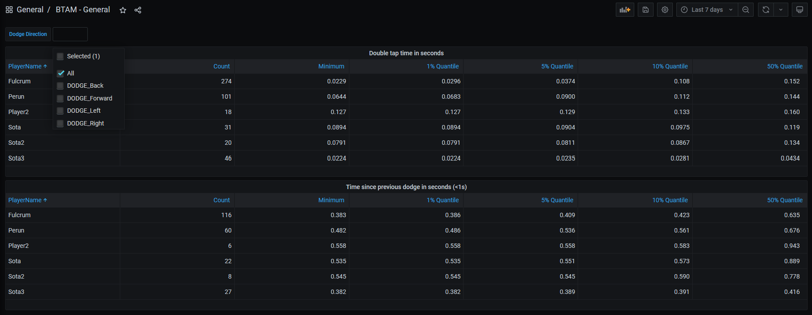
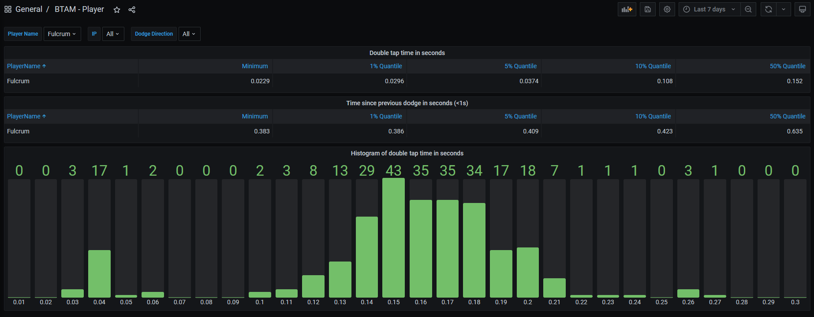

# BTAM (BunnyTrack Anti Macro)

BTAM can be used to track down UT99 players who are using macro's to dodge using a single key press or click. Players doing this have a few advantages:

* They dodge more consistently. Especially on small surfaces or when rushing a map.
* They dodge almost instantly because the delay between two artificial key presses is minimal.
* They can chain dodges more rapidly because a single macro can spam e.g. `move left` multiple times. So as soon as the dodge timeout of 0.35 seconds has passed, the player can already initiate the next dodge with minimal delay.

Nearly 10 years ago I created BTAC which logged whenever a player performed a dodge with a double tap time (= time between two consecutive key presses which resulted in a dodge) faster than a certain threshold. This could sometimes glitch which resulted in a false positive. On top of that, making a good assessment about a player is hard with such little amount of data, which I tried to resolve with BTAM.

You can download the latest version of BTAM on the [Releases page](https://github.com/mbovijn/BTAM/releases/). If you find any bugs, feel free to contact me on Discord or to create an issue here on GitHub.

\- Fulcrum

## BTAM UnrealScript

To install BTAM on your UT99 server, put the following two lines under the `[Engine.GameEngine]` section in your `UnrealTournament.ini` file, and copy over `BTAMv1.u` to the UT99 System folder.

```ini
ServerActors=BTAMv1.Main
ServerPackages=BTAMv1
```

This will cause each dodge of each player to be logged to a file named e.g. `BTAM.2021.06.07.11.31.19.852.0.0.csv` in the `Logs` folder. Each time a new map loads, a new file will be created. The contents look as follows:

```csv
Timestamp,PlayerName,IP,DodgeDir,DoubleTapTimeInSeconds,TimeSincePreviousDodgeInSeconds
2021-06-07T11:32:31.540,Fulcrum,127.0.0.1,DODGE_Left,0.144915,66.124443
2021-06-07T11:32:33.040,Fulcrum,127.0.0.1,DODGE_Forward,0.125066,1.202719
2021-06-07T11:32:40.939,Fulcrum,127.0.0.1,DODGE_Left,0.169110,7.546015
```

This is a CSV file with header which can be loaded into Excel or any other program that can analyse data, but I recommend the BTAM Analyzer that I created for this purpose.

`DoubleTapTimeInSeconds` = the time between two consecutive key presses which resulted in a dodge. The valid range for this is between 0.00 and 0.30 seconds. If the time between two key presses is longer than 0.30 seconds, there will be no dodge. By default UT sets this to 0.25, but this can be overridden in the configuration to maximum 0.30.

`TimeSincePreviousDodgeInSeconds` = the amount of time that has elapsed since the previous dodge completed (= you landed on the floor after dodging). 0.35 seconds need to pass before a player is able to dodge again, so this value should never be lower than 0.35 seconds.

## BTAM Analyzer

To analyse all this data we can ingest the data into InfluxDB using Telegraf, and visualize it with Grafana.

Installation steps:

1. Install Docker on the UT99 server.
2. Copy the `btam-analyzer` folder to the UT99 server.
3. In `btam-analyzer/telegraf/etc/telegraf.conf` change the value next to the `csv_timezone` field to the appropriate one. This will make Grafana display the timestamps correctly.
4. In `btam-analyzer/docker-compose.yml` change `C:/Program Files (x86)/Unreal Tournament GOTY/Logs` with the path to your UT99 Logs folder.
5. In a terminal window go to the `btam-analyzer` folder and execute `docker compose up -d`.

After following these steps, Telegraf will automatically scan the Logs folder each 30 seconds for new BTAM CSV files. The data will be ingested into InfluxDB, and should be visible in Grafana. Once ingested the BTAM log files may be deleted.

Now you can browse to Grafana <http://127.0.0.1:3000> and login with the default credentials `admin:bunnytrack`. There you will find two dashboards.

The first dashboard is a general one with data about all players.


The second dashboard contains data specifically about one player.

